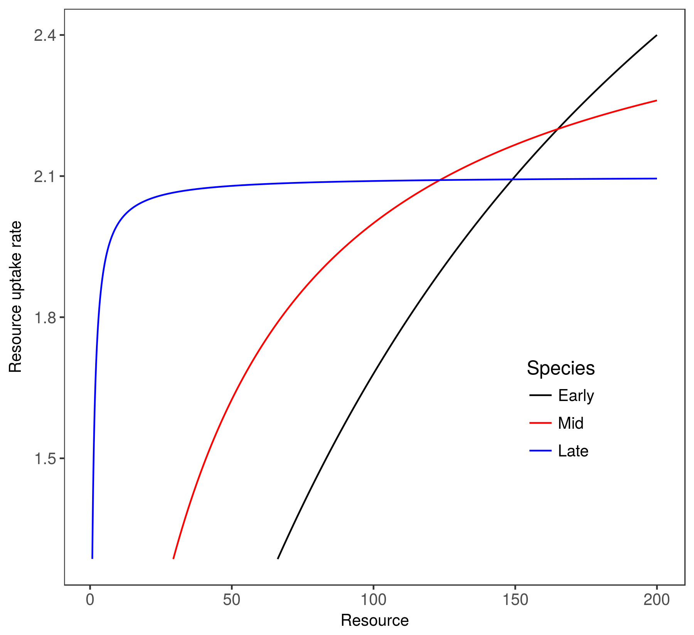

```{r caching, include=FALSE}
library('png')
library('grid')
library("methods")
library("knitr")
basename <- "manuscript"
opts_chunk$set(fig.path = paste("components/figure/", basename, "-", sep=""),
               cache.path = paste("components/cache/", basename, "/", sep=""))
opts_chunk$set(cache = FALSE)
opts_chunk$set(tidy=FALSE, warning=FALSE, message=FALSE, 
               comment = NA, verbose = TRUE, echo=FALSE)

# PDF-based figures
opts_chunk$set(dev='pdf')
```

```{R echo = FALSE}

```


\renewcommand*{\thefootnote}{\fnsymbol{footnote}}

\begin{titlepage}
\begin{centering}

\sloppy

\ 

\ 

\ 

 


\textbf{\large{Where do higher order interactions come from?}}

\textsc{\small{Andrew R. Kleinhesselink\footnote{Corresponding author: arklein@ucla.edu}\textsuperscript{1}, Jonathan M. Levine\textsuperscript{2}, Nathan Kraft\textsuperscript{1}}


\textit{\small{\textsuperscript{1}Department of Ecology and Evolutionary Biology, University of California, Los Angeles 621 Charles E. Young Drive South Los Angeles, CA 90095 USA}} \\
\textit{\small{\textsuperscript{2}ETH, Zurich Switzerland}} \\

\end{centering}

\bigskip \textbf{Running title:} Higher order interactions

\smallskip \textbf{Submission type:} Article
\vspace{3 cm}


\renewcommand*{\thefootnote}{\arabic{footnote}}
\setcounter{footnote}{0}

\end{titlepage}
\pagebreak{}
\linenumbers

Abstract
--------

In most classical models of species competition, the outcome of competition is determined by pairwise competition coefficients.  However, almost every community on earth contains many more than two species, and almost every species interacts with more than one other competitor. It may be a mistake to assume that models based upon only pairwise per capita competition adequately describe multi-species communities.   

Specifically, higher order interactions (HOI) complicate the use of pairwise competition coefficients for any community with three or more species. HOIs occur when pairwise competition coefficients are not fixed and instead depend on the density of other species in the community. The question of when and where HOIs occur is thus critical to extending the insights derived from two species models to natural communities.

In this paper we examine how and when HOIs emerge in simple competition models when more than two species compete. We break the origin of HOIs into cases where they result from changes in species densities or sizes that are not captured in the model structure and cases where they emerge due to changes in resource use through time. 

We conclude that HOIs may be likely to arise when competitors engage in multiple rounds of competition across the life-cycle. In mechanistic models, we suggest that HOIs may also emerge when per capita resource consumption is not fixed, but instead varies over time. Clarifying the source of HOIs in simple analytical and simulation models may help us better understand the true nature of competition and the stability of multispecies communities. 


*Key words: competition, coexistence theory*

Introduction
-------------

Almost every species on earth interacts with a vast number of predators, pathogens and competitors. And the densities of each of these species, are themselves determined by interactions with yet other species in the community. Nonetheless, most classical models in community ecology summarize species interactions with fixed pairwise interaction coefficients. In particular, pairwise competition coefficients have been critical to the development of modern coexistence theory (MCT). A powerful implication arising from the assumption of fixed pairwise competition coefficients is that the outcome of multi-species species competition can be predicted by measuring the outcome of competition between all pairs of species in that community (cite). This assumptions leads to the idea that a general theory of species competitive exclusion and coexistence can be achieved if one could simply map pairwise differences in species' traits and physiology to species pairwise competition coefficients [@kraft_plant_2015; @adler_trait-based_2013]. 

The possibility of higher order interactions (HOIs) between species challenges the core assumption of pairwise competition coefficients.  By definition, HOIs mean that pairwise competition coefficients are not themselves fixed, but depend upon the densities of other species in the community. Among other issues that arise in a world of HOIs are classical definitions of coexistence and the niche which rely upon comparing pairwise intraspecific competition coefficients to interspecific competition coefficients (Chesson, etc. etc.).  If HOIs are common, then predicting community assembly in natural multi-species communities might not be achieved by measuring all possible pairwise competitive interactions. Thus, a thorough empirical and theoretical investigation of HOI in natural communities is critical to expanding ecological beyond two species models and increasing its relevance in the natural world.  

#### Defining higher order interactions 

Despite the potential importance of HOIs in a multi-species world, competitive HOIs have received relatively little theoretical or empirical attention. This extends even to the matter of defining what they are.  

To even begin discussing HOIs, we need to first define competition.  We approach the definition from a mechanistic perspective first and then a phenomenological perspective.  From a mechanistic perspective, competition occurs when individuals consume the same limiting resources. Increases in consumer densities change the availability of resources which then changes the growth rate of consumers. Thus at its most basic resource competition can be thought of as an indirect effect between individuals mediated by resource concentration. Equivalent models apply to any limiting environmental factors, such as shared mutualists and shared predators and pathogens (apparent competition).  

In contrast, the phenomenological definition of competition dispenses with external environmental factors such as resource concentration and instead focuses on the indirect effects themselves. Phenomenological competition is measured as the reduction in a per-capita population growth rate due to an increase in density of individuals of the same trophic level (cite). This perspective on competition is extremely powerful because it includes all shared resources and other environmental feedbacks into one effect that can be measured empirically. A phenomenological definition of competition also encompasses direct interactions between individuals of the same trophic level, such as hemiparisitism, intra-guild predation, interference competition and allelopathy. 

We contrast mechanistic and phenomenological approaches to competition because they have fundamentally different implications for HOIs. In a mechanistic model, it is quite hard to define HOIs.  If one knows the resource consumption rates of each species, and the value of those resources to each species' population growth rate, then you can calculate the indirect effects of each species on each other and the stability and trajectory of multi-species communities. HOIs are a non-issue because they are implicit in the model. 

However, in a phenomenological model, the structure and stability of the community depends on the effects of species densities on other species population growth rates and in this case HOIs have a clear definition. In figure 1, competitive effects are depicted as arrows showing that density of species two reduces the vital rate of species one by some factor $\alpha_{12}$. The dashed arrow shows that species three modifies the competitive effect of species two on one. We take this kind of interaction modification to be an HOI, specifically a second order competitive interaction.  More generally, pairwise interactions occur when the effect of species $j$ on species $i$ depends only on the density of species $j$ and HOIs occur whenever the effect of species $j$ on species $i$ depends also on the density of species other than $j$.    


As further illustration of our definition of HOIs we start with a general model for species phenomenological competition,   

\vspace{-1em}
\begin{equation} \label{eq1}
n_{i,t+1} = n_{i,t}f(C), 
\end{equation}

where $n_{i,t}$ is the density of species $i$ at time $t$, $f$ is a function that gives the per capita population growth rate as a function of total competition experienced $C_i$. Competition between species $i$, $j$ and $k$ is pairwise and does not involve HOIs if each species contributes linearly to competition such that $C = \sum\alpha_{i,j}(n_j)$, where $\alpha_{i,j}$ is a function of competitor density $n_j$. In contrast, HOIs occur whenever overall competition $C$ cannot be broken down into additive pairwise components. 

Consider defining the competition experienced by species 1 as: $C_1(n_1,n_2,n_3) = (\alpha_{1,1}n_{1} + \alpha_{1,2}n_{2} + \alpha_{1,3}n_3)$.  If we relax the assumption that pairwise competition coefficients are fixed and instead allow the competition coefficients to depend on other competitor densities, our model now includes the possibility of HOIs.  Replace $\alpha_{1,2}$ with a linear function of $n_3$, $a(n_3) = \alpha_{1,2} + \beta n_3$. Now the competitive effect of $n_{2}$ on $n_{1}$ depends on $n_3$. The equation for competition can be re-written as, $C_1 = (\alpha_{1,1}n_{1} + \alpha_{1,2}n_{2} + \beta n_{2}n_{3} + \alpha_{1,3}n_{3})$.

In this example, $\beta$ captures a second order HOI effect of species $2$ and $3$ together. As long as $\beta \neq 0$ we can no longer isolate the pairwise effect of species $2$ or $3$ on species $1$. In general, more diverse communities allow for HOIs of greater order, with a community of $s$ species having HOIs of the order $s-1$ possible. From an empirical perspective, the presence of HOIs means that if we measure the per capita population growth rate of each focal species $i$ when it is rare ($n_i \approx 0$), and we vary the density of each of the competitors (including $i$ itself), this will not be enough to predict the dynamics in a three, or even a two species community! 

Now that we have defined HOIs, we explore a variety of mechanistic and phenomenological models in order to try and classify the origin of HOIs.  Finally we evaluate whether any of the examples are likely to generate HOIs in nature. 

HOIs arrising from cycles of pairwise competition
--------------------------------

HOIs could arise in discrete time models when the time step involves aggregating of a sequence of pairwise competition events. In a recent theoretical analysis, Grilli et al. (2017) provided a concise demonstration of this effect.  In their model, seedling trees compete to fill a forest gap.  If competition for the gap occurs as a sequence of competitive rounds between pairs of individuals then HOIs naturally emerge.  This counter intuitive result occurs because the probability that a species wins the gap depends not only on its direct pairwise interactions, but also on the pairwise interactions between its competitors. In effect, which competitor the species interacts with in round two of the tournament depends on those competitors interactions in round one. Because of these indirect effects, we cannot express the gap filling tournament with a single set of pairwise competition coefficients, we need to include HOIs in the model.

In the Grilli model, competition involved a tournament of discrete winner-take-all competitive events. The idea of having plant competition occur one at a time may perhaps seem unrealistic. However, their model captures a general process that could apply to many types of models. As another example we consider an annual plant population that follows a two stage model. Seeds germinate and survive into adults with probability $p$: $a = n_{t}p$, where $a$ is adult density at an intermediate time within the growing season, and $n_{t}$ is the initial seed density at the time $t$. After that, adults produce the next generation of seeds via a fecundity rate $f$: $n_{t+1} = af$. Because the plants are annuals there is no adult survival. 

We can introduce competition by making fecundity of species $i$ a function of adult density of all species in the community: $f_i = f_i(a_i, a_j)$.  Seedling germination and survival could also be function of competition, so we could make $p_i$ a function of initial seed density such that $p_i = p_i(n_i, n_j)$. 

Now we consider a two species community with initial seed densities for species one and two of $n_1$ and $n_2$ and calculate the per capita seed production of species 1 over the time step $t$ to $t+1$,  

\vspace{-1em}
\begin{equation} \label{eq2}
\frac{n_{1,t+1}}{n_{1,t}} = p_1( n_{1,t}, n_{2,t} )f_1( a_{1,u}, a_{2,u} ) 
\end{equation}

In the model above, adult density is an intermediate state variable that is both the product of competition during the first part of the growing season but also contributes to competition during the reproductive phase. Re-writing to eliminate the intermediate phase, 

\vspace{-1em}
\begin{equation} \label{eq3}
\frac{n_{1,t+1}}{n_{1,t}} = p_1( n_{1,t}, n_{2,t} )f_1( n_{1,t}p_1( n_{1,t}, n_{2,t} ), n_{2,t}p_2( n_{1,t}, n_{2,t} ) ) 
\end{equation}

This equation shows that the effect of two on one cannot be fully captured by pairwise effects. It also depends on the initial density of one and how strongly one reduces the survival of two. This is apparent when considering the arguments to the fecundity function $f_i$ contains the density of both competitors multiplied by their survival functions.  

Aggregating the survival and reproduction phases of the life-cycle and the competitive effects on each, results in a complicated equation involving numerous polynomial terms of $n_{1,t}$ and $n_{2,t}$ and HOI terms.  

One way of interpreting the above model is to consider it a case where there is a distinct survival niche and a distinct fecundity niche.  The survival niche is encoded by the matrix $\alpha_ij$ whereas the fecundity niche is encoded by $\beta_ij$. Most plant populations encompass some kind of stage structure and it seems likely that competitive effects between individuals probably vary depending on the stage structure.  
*I'd like to do some more work on this.  I think having an example where we show how HOIs emerge analytically. Specifically if we could show analytically how the two stages of competition given by the $\alpha$ and $\beta$ in a two stage lifecycle model contribute to HOIs that would be really useful.  My hunch is that HOI terms cancel out in some circumstances which is why we can successfully model populations without HOI terms in a lot of cases.  The problem is that the expression for HOIs will depend very much on how we account for competition in the two lifestage transitions.  Unfortunately, I wasted a lot of time trying to analyze the above and have become a bit stuck!*

HOIs in a mechanistic resource competition model
----------------------------------

Unlike the phenomenological model above, we can also imagine HOIs emerging from mechanistic models. 

Because experimental data evaluating HOIs at the demographic level is lacking, we developed a mechanistic simulation of annual plant competition for a single shared resource. We then try and describe competition in the system using a simple phenomenological competition model.

#### Resource mechanistic model

Our mechanistic model is inspired by California annual plant communities growing in a Mediterranean climate.  In this environment, rainfall starts in the winter and gradually declines through the spring while temperature and evaporative demand increase.  Plants germinate in the winter and begin to flower in spring.  By summer, most plants have completed flowering and produce seeds and die.  In our model we track a single pool of generic soil resources, perhaps water or mobile inorganic nutrients.  The resource supply rate spikes in early spring and then goes to zero as the spring progresses.  Thus the pool of resources is exemplified by non-equilibrium pulse dynamics and never reaches an equilibrium.  

In our model, rates of plant growth depend on resource availability. As spring progresses, plants grow larger but resource supply diminishes.  Eventually plants reach a point where their resource uptake rates cannot keep up with respiration and maintenance costs.  At this point, we assume that plants stop producing vegetative biomass and start producing seeds. We simplify this by assuming that all biomass is converted to seed biomass at a fixed rate instantaneously. At this point the adult plants die and stop taking up resources.  

The model is expressed as a set of differential equations, 

\vspace{-1em}
\begin{equation} \label{eq4}
\frac{dR}{dt} = S(t) - \sum_{i = 1}^sB_{i}f(R,r, K)
\end{equation}

where $R(t)$ gives the resource availability at time $t$, and $S$ gives the resource supply rate at time $t$. The final term expresses the loss of resources due to uptake by plants.  We sum over each of the $s$ species in the community to get total uptake. Annual plant biomass of species $i$ at time $t$ is given by $B$ and the uptake rate is a function $f_i$ of total resource availability. We simulate a Mediterranean climate by setting initial resource availaibility high setting the resource supply rate $S(t)$ to zero.

Growth of each species depends on resource availability,  

\vspace{-1em}
\begin{equation} \label{eq5}
\frac{dB_{i}}{dt} = B_{i}(qf_i(R) - m)
\end{equation}

Where, $B_i$ is the total biomass of species $i$, $q$ is a resource conversion factor, $m$ is a per biomass respiration and tissue loss rate, and as in the first equation, $f_i$ is the resource uptake rate.  

In this model, the growth of each species stops when $qf_i(R) = m$ meaning that biomass gained is equal to biomass lost to respiration and maintenance.  Because the summer drought will only further reduce resource concentrations, the optimal behavior of the plant at this point is to stop growing and convert stored resources to seed mass. We impose this behavior on the model by setting biomass at time $z$ ($B(z)$) to zero when $m$ matches resource uptake and conversion: $qf_i(R(z)) = m$. 

Different species are likely to have different rates of resource uptake, respiration and tissue loss rates.  In our simulations we assume a trade-off between rates of resource uptake at high resource availability and rates of resource uptake at low resource availability. This means that species which dominate early in the season when resource availability is high will stop growing earlier in the season as resource availibility declines. In contrast, species that grow slower early in the growing season are able to persist later into the season when resource availability is low. 

We enforce this trade-off between species by giving each species $i$ a unique resource uptake function $f_i$ that depends on two species specific parameters $r_i$ and $K_i$, 

\vspace{-1em}
\begin{equation} \label{eq7}
f_i(R, r_i, K_i) = r_iR/(K_i + R)
\end{equation}

Example resource uptake curves for a fast growing early season species, a mid season species, and a slower growing late season species (resource uptake fig). 



The unique resource uptake curves for species one and two result in species one growing faster earlier in the season but also flowering and senescing earlier.  Species two grows slower early in the season but is able to grow later into the season (growth phenology fig). 

![Example time series showing draw down of the resource during the course of the simulation, upper panel, and growth of each of the species, lower panel.  Species one grows rapidly early in the season, but senesces early as well. Species three grows slowly early in the season but grows for a longer period of time. Species is somewhere between these extremes. Each species reaches its peak biomass at a different time, at which point we assume all vegetative biomass is converted to seed mass, and resource uptake by that species stops.](../figures/example_timeseries.png)

So far we have described a model run in continuous time within a single generation. For this model we denote rates of change of biomass and resources within the season in terms of very small time intervals $t$. By contrast, we keep track of total population size of each generation at a discrete annual time scale $\tau$.  To calculate the total population size of each species at time step $tau+1$ we take each species' maximum vegetative biomass during the growing season, multiply that by a conversion factor $c$ to get a seed mass, and then multiply that by a constant seed per gram ratio, $\mu$.  Thus,     

\vspace{-1em}
\begin{equation} \label{eq6}
n_{i,\tau+1} = \mu c(\max B_i)_{\tau}, 
\end{equation}

where $n_{i,\tau+1}$ is the number of seeds produced. To simplify the interpretation of the model, we assume that there is no seed mortality between years and all seeds germinate. 

We simulate these dynamics using the ordinary differential equation solvers package $\tt{desolve}$ in the statistical program R.  Simulation parameters and code to run the simulations are given in the supporting information. 

#### Response surface experiment

Using the model described above we simulated a response surface experiment where individuals of each of the three species are grown against increasing densities of inter- or intraspecific competitors. We then calculate the per capita reproductive output of the focal species and fit phenomenological competition models to our simulated data. We only include simulations in which the focal species faces fewer than three competitor species at once. 

#### Phenomenological annual plant model 

We model annual plant competition in terms of the decline in per capita reproductive output with increasing density of competitors at the start of the growing season ($n_{j,tau}$).  We use a standard functional form for phenomenological competition that has been used a  number empirical studies of annual plant competition [@kraft_plant_2015],  

\vspace{-1em}
\begin{equation} \label{eqBeverton}
\frac{ n_{i,\tau+1} }{ n_{i,\tau} } = \lambda_{i}/(1 + \sum^3_{j=1} \alpha_{i,j} n_{j,\tau})^{ \eta_i } ,
\end{equation}

where $\eta_{i} > 0$ and $\lambda_i > 0$. In this model, $\lambda_i$ denotes maximum per capita reproductive output, $\alpha_{ij}$ is the per capita competitive effect of species $j$ on $i$ and $\eta_i$ is a species specific parameter controlling the how steep fecundity declines with competition in general. We refer to this functional form as the basic model. 

In order to assess the importance of HOIs, we can include various higher order terms in the basic functional form. In the case of three species, this includes three pairwise effects, three quadratic effects and three second order HOI terms,

\vspace{-1em}
\begin{equation} \label{eqHOI}
\frac{ n_{i,\tau+1} }{ n_{i,\tau} } = \lambda_{i}/(1 + \sum^3_{j=1} \alpha_{i,j} n_{j,\tau} + \sum^3_{j=1}\gamma_{i,j}n_j^2 + \beta_{i,1}n_1n_2 + \beta_{i,2}n_1n_3 + \beta_{i,3}n_2n_3)^{ \eta_i },
\end{equation}

We refer to this competition model as the HOI model. We fit each of these competition models using the $\tt{nls}$ function in the statistical language R. We calculate $\lambda_{i}$ for each species as the per capita fecundity in the absence of any competitors, and set this as a fixed parameter in the model.  

#### Model fits

The basic Beverton-Holt functional form (eq.) is a good fit for the effects of both inter and intraspecific competition on species one and adding HOI terms does not qualitatively improve model fit (fig below). 


For species two we see more of a discrepancy between the basic and HOI model fits ( fig below). This is especially apparent in the third panel which shows the interaction between the densities of species one and species three. The basic model tends to underpredict the impact of species one and two together on species two. 


Finally, for species three, we see an even greater discrepancy between the basic and HOI model fits (fig below).  This is apparent in all three panels.  The HOI fit appears to be quite good in the first two panels. The HOI fit appears to be least accurate at high densities of species one and low densities of species two (rightmost panel). 


For each of the three species, including HOI and quadratic terms improves model fit in terms of residual squared error (table below). For species one, the quadratic and HOI terms are small relative to the pairwise effects. For species two and three, the HOI terms are of similar magnitude to the pairwise effects, in some cases stronger. 

```{r echo = FALSE, results = 'asis'}

library(knitr)
library(tidyverse)
load( '../data/fits_df.rda')
fits_df <- 
  fits_df %>% 
  select(species, model, starts_with('alpha.'), starts_with('gamma.'),
         starts_with('beta.'), residual_error)

fits_df <- fits_df %>% rename('$N_1$' = alpha.1,
                              '$N_2$' = alpha.2, 
                              '$N_3$' = alpha.3, 
                              '$N_1^2$' = gamma.1,
                              '$N_2^2$' = gamma.2,
                              '$N_3^2$' = gamma.3, 
                              '$N_1N_2$' = beta.1,
                              '$N_1N_3$' = beta.2,
                              '$N_2N_3$' = beta.3,
                              'error' = residual_error)

options(knitr.kable.NA = '-')

kable(fits_df, digits = 2, caption = 'Fitted HOI parameters and residiual squared error for the basic model and the model containing higher order interaction terms')

```


#### Interpreting the fits

It is clear from the above example that a relatively simple resource consumption model may require HOI terms in order to be fit by a phenomenological model.  The obvious question is how to interpret these additional quadratic and second order HOI terms. On the one hand it should not be surprising that adding additional terms improves model fit. Many functions can be approximated to an arbitrary level of precision by a power series. We essentially are approximating a power series by summing over polynomial terms of ever increasing order.  

However, in this case we believe the HOI effects play a more meaningful role than simply helping us approximate an completely unknown function.  In support of this argument, we note that the basic Beverton-Holt model does an adequate job fitting the response of species one to the competitive effects of one and two. It is only for species two and three that we begin see evidence of important HOI effects. 

We believe this has to do with the temporal nature of competition in this system. While species one is active, species two and three are also always active. Thus the effects of intitial competitor density on species one are relatively simple. Increasing densities of competitors will supress the resource capture by species one and thus change its overall performance in a constant manner regardless of the mix of species. 

However, for species two and three the competitive environment is more complex. For example, take species two competing only against species one. The growing season can be split up into two phases: the first part of the growing season over which species two interacts with species one and itself;  and the second part of the growing season where species two only interacts with itself. Working backwords from the time when species two flowers, we might be able to predict its ultimate size and fecundity from its biomass at the time that species one stops growing.  That part of the growing season only involves intraspecific competition so it should be relatively simple.  But the intraspecific competition experienced by species two over this second part of the growing season depends on how large it is at the start of this second phase of growth.  So we have to predict its size at the start of phase two. This in turn, depends on the inter- and intraspecific competition experienced over the first phase of the growing season. 

Keeping this in mind we can rationalize the HOI terms for species two as describing the inter- and intraspecific effects of competitor density on species two during the first phase of the growing season, multiplied by only the intraspecific over the second phase of the growing season. For species two this leads to a strong effect of intraspecific densities squared, and an effect of interspecific density multiplied by intraspecific density (table above). Noticably absent is a quadratic effect on the density of species one, which makes sense given this interpretation (table). 

Likewise there is an HOI term for the effects of species one and three acting together on species two. Once again, we need to consider the two phases of competition experienced by species two. First the density of species one and three will determine the biomass of species three when species one flowers. This will then determine the interspecific effects of species three on two during the second phase of the growing season for species two.  Thus we see a strong effect of species three's density squared and a strong HOI between the intial density of species three and species one.

The competitive dynamics for species three are even more complex.  This late season species goes through three distinct phases of competition, first competing with all three species, then only with two and then finally with only itself.  Working backwards from its final bimoass and reproductive output, species three's performance will depend on its size when species two flowers, which will depend on the size of two and three when species one flowers, which will depend on the inital densities of all three species. Because there are effectively three cycles of competitor density and response to consider for species three its reasonable to expect that third order HOI terms resolve some of the lack of fit observed for this species (see figure ). 

This system is characterized by a seasonal pulse of resource availability and the lack of an equilibrium between species biomass and resource concentrations in the environment.  In contrast, if resources were supplied continually, at some level $S$, then eventually species biomass would increase until resource uptake matched this level of resource supply. This is a classic result from mechanistic resource modeling (chemostat papers, Tilman etc.). At this equilibrium, the sensitivity of each species to the densities of each other species can be approximated with a linear phenomenological model (cite Meszena, Kleinhesselink, Tilman). This focus on the equilibrium dynamics, and an avoidance of the messiness inherent in periodically forced non-equilibrium systems may be one reason HOI's have received little attention among competing species. 

Discussion 
------------ 

Conclusions/Summary (?? )
-------------- 

We have sought to clarify the definition of HOI's and explain how they could arise from relatively simple competitive dynamics.  We illustrate this point with two hypothetical models of species competition. In the first model, simple pairwise interactions iterated over multiple life stages could lead to HOI's. In the second, we show that a community characterized by pulses of resource supply and sequential cycles of species competition and senescence could also lead to HOI's. A general theme in both models, is that HOI's arise when the competitive environment and species abundances change at a time step shorter than the interval over which the effects of competition are observed. As researchers begin to focus their efforts on detecting HOIs, it seems likely that HOI's will increasingly be found among competiting species.  


Acknowledgments
---------------

\pagebreak{}

References
----------
\setlength{\parindent}{-0.2in}
\setlength{\leftskip}{0.2in}
\setlength{\parskip}{12pt}
\noindent


<div id="refs"></div>


\pagebreak{} 

\setlength{\parindent}{0in}
\setlength{\leftskip}{0in}
\setlength{\parskip}{12pt}

Tables
------

<!-- \captionsetup{width=14cm} -->
<!-- \begin{table}[ht] -->
<!-- \centering -->
<!-- \caption{Summary of } -->
<!-- \label{tab:table1} -->
<!-- \begin{tabular}{llll} -->
<!--   \toprule -->
<!--   \input{ test.txt} -->
<!-- \end{tabular} -->
<!-- \end{table} -->


\pagebreak{}


Figure Legends
-------

**Figure \ref{fig:hypothesis}.** 

**Figure \ref{fig:map}.** 

**Figure \ref{fig:effects}.** 

\pagebreak{}


Figures
------

<!-- \begin{figure}[!ht] -->
<!--   \centering -->
<!--       \includegraphics[width=6in]{../figures/hypothesis.png} -->
<!--   \caption{} -->
<!--   \label{fig:hypothesis} -->
<!-- \end{figure} -->


\pagebreak{}


Appendix S1:
===========================================================================

\beginsupplement


```{R echo = FALSE}

```


Mechanistic Model
------


\pagebreak{}


Tables
------

<!-- \captionsetup{width=14cm} -->
<!-- \begin{table}[ht] -->
<!-- \centering -->
<!-- \caption{} -->
<!-- \label{tab:subspecies} -->
<!-- \begin{tabular}{llll} -->
<!--   \toprule -->
<!--   \input{ ../data/table.txt} -->
<!-- \end{tabular} -->
<!-- \end{table} -->


\pagebreak{}


Figures
-------


<!-- \begin{figure}[!ht] -->
<!--   \centering -->
<!--       \includegraphics[width=6in]{../figures/test.png} -->
<!--   \caption{} -->
<!--   \label{fig:test} -->
<!-- \end{figure} -->


